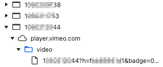
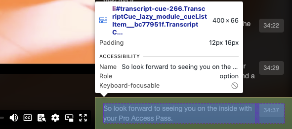

# dirty-vimeo-transcript-downloader

## How to Use
1. Get the Vimeo Video Link. If you are in a webinar, you can either:
    - Right click the video and click "View Frame Source". Look for the link like ```https://player.vimeo.com/video/1234567890?h=a123456b78"``` in the head section; Or
    - Open the Development Tool (F12). Go to Sources, and look for the 10-digit number and see if it contains "player.vimeo.com". If yes, right click and copy the whole link.
    
2. Go to the link with Chrome.
3. Open the Transcript from the bottom right corner.
4. Scroll the Transcript to the bottom.
5. Use the Inspector in the Development Tool to check the number of the last element. That is the totalCues.
    
6. Scroll back to the top and click the first element **(IMPORTANT!)**
7. Copy the whole code.
8. Go to Console in the Development Tool, and paste the code.
9. Edit the totalCues in the code. **(IMPORTANT!)**
10. Run and download. Done!

## Credit
https://www.reddit.com/r/vimeo/comments/1c2x64f/any_easy_way_to_copy_vimeo_transcript_want_to/
